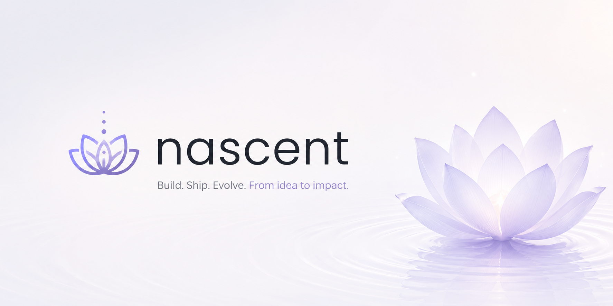
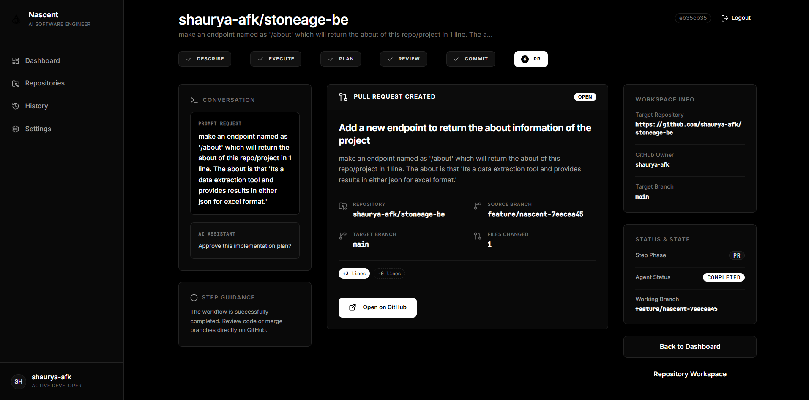

# Nascent

<p align="center">
  
</p>

<h3 align="center">
Autonomous AI Software Engineering Agent
</h3>

<p align="center">
Nascent understands your codebase, plans implementation, generates production-ready code, presents Git diffs for approval, and automatically commits, pushes, and creates Pull Requests.
</p>

<p align="center">
  <a href="https://nascentai.vercel.app/">🌐 Website</a>
  ·
  <a href="https://github.com/shaurya-afk/nascentai">💻 Frontend</a>
</p>

<p align="center">
  
  
  
  
  
  
  
</p>

---

# Overview

Modern AI coding assistants are excellent at generating snippets of code.

Nascent takes a different approach.

Instead of treating every prompt independently, it first understands the repository, builds a structured representation of the codebase, plans the required implementation, loads only the relevant context, generates production-ready changes, and safely completes the engineering workflow by creating commits and Pull Requests.

Nascent is designed for **real software engineering workflows**, not isolated code generation.

---

# Demo

> Demo GIF Coming Soon

```
Repository
     │
     ▼
Understand Codebase
     │
     ▼
Generate Plan
     │
     ▼
Human Approval
     │
     ▼
Load Context
     │
     ▼
Generate Code
     │
     ▼
Git Diff
     │
     ▼
Human Approval
     │
     ▼
Commit
     │
     ▼
Push Branch
     │
     ▼
Create Pull Request
```

---

# Features

| Capability | Status |
|------------|:------:|
| Repository Understanding | ✅ |
| Intelligent Repository Indexing | ✅ |
| Repository Caching | ✅ |
| Planning Before Generation | ✅ |
| Human-in-the-loop Workflow | ✅ |
| Context-aware Code Generation | ✅ |
| Git Diff Generation | ✅ |
| Git Commit Automation | ✅ |
| Automatic Branch Creation | ✅ |
| GitHub App Authentication | ✅ |
| Automatic Push to GitHub | ✅ |
| Pull Request Creation | ✅ |
| Multi-user GitHub Support | ✅ |
| Semantic Repository Search | 🚧 |
| Automatic Test Generation | 🚧 |
| CI/CD Integration | 🚧 |

---

# How Nascent Works

## 1. Repository Understanding

Nascent clones the repository and analyzes the complete project structure.

- File hierarchy
- Modules
- Dependencies
- Architecture
- Existing implementation

---

## 2. Planning

Instead of immediately generating code, Nascent creates an implementation strategy.

Example:

```
User:
Add JWT Authentication

↓

Nascent:

✓ Analyze existing authentication

✓ Identify affected files

✓ Create implementation strategy

✓ Wait for approval
```

---

## 3. Context Loading

Only the relevant files are loaded into context.

This allows the model to focus on the implementation instead of wasting context on unrelated code.

---

## 4. Code Generation

Nascent modifies only the necessary files while preserving the project's coding style and architecture.

---

## 5. Human Approval

Every generated change is presented as a Git diff before execution.

```
+ Added JWT middleware

+ Updated auth routes

+ Added token verification

Proceed?

[Y/N]
```

---

## 6. Git Automation

Once approved, Nascent automatically

- Creates a new branch
- Commits the changes
- Pushes to GitHub
- Opens a Pull Request

---

# Workflow

```text
Repository URL
      │
      ▼
Repository Loader
      │
      ▼
Repository Extraction
      │
      ▼
Repository Index
      │
      ▼
Planning
      │
      ▼
Human Approval
      │
      ▼
Context Loader
      │
      ▼
Code Generator
      │
      ▼
Git Diff
      │
      ▼
Human Approval
      │
      ▼
Git Commit
      │
      ▼
Git Push
      │
      ▼
Pull Request
```

---

# Example Workflow

```
User

Implement OAuth Login

↓

Nascent

✓ Understand repository

✓ Analyze authentication flow

✓ Create implementation plan

✓ Wait for approval

✓ Load required files

✓ Generate code

✓ Present Git diff

✓ Wait for approval

✓ Commit changes

✓ Push branch

✓ Create Pull Request
```

---

# Tech Stack

| Category | Technologies |
|-----------|--------------|
| Language | Python |
| API | FastAPI |
| Agent Framework | LangGraph |
| ORM | SQLAlchemy |
| Database | PostgreSQL, NeonDB |
| Version Control | GitPython |
| Authentication | GitHub OAuth, GitHub App |
| LLM Gateway | OpenRouter |
| Deployment | Docker (Planned) |

---

# Project Structure

```
app/

├── api/
├── auth/
├── database/
├── github/
├── graph/
├── prompts/
├── services/
├── utils/
├── cache/
├── models/
└── main.py
```

---

# Getting Started

## Clone Repository

```bash
git clone https://github.com/shaurya-afk/nascent.git

cd nascent
```

---

## Create Virtual Environment

```bash
python -m venv .venv
```

Activate

### Windows

```bash
.venv\Scripts\activate
```

### Linux / macOS

```bash
source .venv/bin/activate
```

---

## Install Dependencies

```bash
pip install -r requirements.txt
```

---

## Configure Environment Variables

Create a `.env` file

```env
DATABASE_URL=

OPENROUTER_API_KEY=

GITHUB_CLIENT_ID=

GITHUB_CLIENT_SECRET=

GITHUB_APP_ID=

GITHUB_PRIVATE_KEY=

JWT_SECRET=

FRONTEND_URL=
```

---

## Run Database Migrations

```bash
alembic upgrade head
```

---

## Start the Server

```bash
uvicorn app.main:app --reload
```

---

# Current Capabilities

- GitHub OAuth Authentication
- GitHub App Installation
- Repository Cloning
- Repository Indexing
- Repository Context Caching
- Planning Agent
- Human Approval Workflow
- Context-aware Code Generation
- Git Diff Generation
- Automatic Git Commit
- Automatic Branch Creation
- Automatic Push
- Pull Request Creation

---

# Roadmap

## Completed

- [x] Repository indexing
- [x] Repository caching
- [x] Planning workflow
- [x] Human approval
- [x] GitHub OAuth
- [x] GitHub App integration
- [x] Automatic commits
- [x] Automatic PR creation

## In Progress

- [ ] Semantic repository search
- [ ] Streaming agent execution
- [ ] Parallel code generation
- [ ] Multi-agent orchestration
- [ ] Test generation
- [ ] Automatic code review

## Planned

- [ ] VS Code Extension
- [ ] CLI
- [ ] Docker deployment
- [ ] CI/CD integration
- [ ] Team collaboration
- [ ] Multi-repository support

---

# Why Nascent?

| Traditional AI Coding | Nascent |
|-----------------------|----------|
| Generates isolated code | Understands the entire repository |
| Minimal planning | Explicit implementation planning |
| No repository memory | Repository indexing & caching |
| Limited Git integration | Full GitHub workflow |
| Manual PR creation | Automatic Pull Request creation |
| Weak engineering workflow | End-to-end software engineering workflow |

---

# Screenshots

<p align="center">
  
</p>


- Repository Analysis
- Planning Interface
- Git Diff Approval
- Pull Request Creation

---

# Contributing

Contributions are welcome.

```bash
Fork the repository

↓

Create a feature branch

↓

Commit your changes

↓

Push your branch

↓

Open a Pull Request
```

---

# License

Licensed under the MIT License.

See the `LICENSE` file for more information.

---

# Author

**Shaurya Sharma**

- Portfolio: https://shauryasha.com
- GitHub: https://github.com/shaurya-afk
- LinkedIn: https://linkedin.com/in/shaurya-afk

---

<p align="center">
Built with ❤️ to make software engineering more autonomous.
</p>